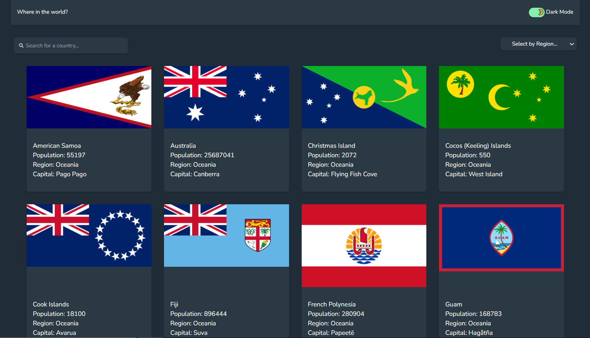
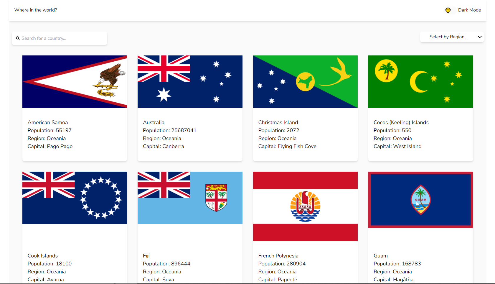

# Frontend Mentor - REST Countries API with color theme switcher solution

This is a solution to the [REST Countries API with color theme switcher on Frontend Mentor](https://www.frontendmentor.io/challenges/rest-countries-api-with-color-theme-switcher-5cacc469fec04111f7b848ca/hub). Frontend Mentor challenges help you improve your coding skills by building realistic projects. 

## Table of contents

- [Overview](#overview)
  - [The challenge](#the-challenge)
  - [Screenshot](#screenshot)
  - [Links](#links)
- [My process](#my-process)
  - [Built with](#built-with)
  - [What I learned](#what-i-learned)
  - [Continued development](#continued-development)
- [Author](#author)
- [Acknowledgments](#acknowledgments)

## Overview

### The challenge

Users should be able to:

- View the optimal layout for the game depending on their device's screen size
- See information about different countries
- Switch between light and dark theme
- Search for any country
- Filter the country based on region

### Screenshot

### Links

- Solution URL: [solution URL](https://github.com/zohaibxJackie/Countries-Info-Application)
- Live Site URL: [Rock-Paper-Scissor-Game](https://zohaibxjackie.github.io/Countries-Info-Application/)

## My process

### Built with

- Html 5
- Tailwind
- Desktop-first workflow
- [React](https://reactjs.org/) - JS library

### What I learned
By doing this project, I was able to understand props in more detail. Furthermore, I learned about REST APIs. I was an excellent journey to learn about React in more detail.

### Continued development

Although, I have learned a lot from this project but there are still many areas where I need improvements especially using the context api and passing props. I will try to implement these things in my future prjects.

## Author

- Website - [Muhammad Zohaib](https://muhammadzohaib4.wordpress.com/)
- Frontend Mentor - [@zohaibxJackie](https://www.frontendmentor.io/profile/zohaibxJackie)
- Linkedin - [@MuhammadZohaib](www.linkedin.com/in/muhammad-zohaib-a42923316)
- Instagram - [@muhammadzohaibofficial1](https://www.instagram.com/muhammadzohaibofficial1?igsh=bHQwN3FoMm5idXd2)

## Acknowledgments

I would like to thank [@FrontendMentor](https://www.frontendmentor.io/) for giving me this opportunity to improve myself, and also for sharing these resources for free. Your guidence have been greatly appreciated.
